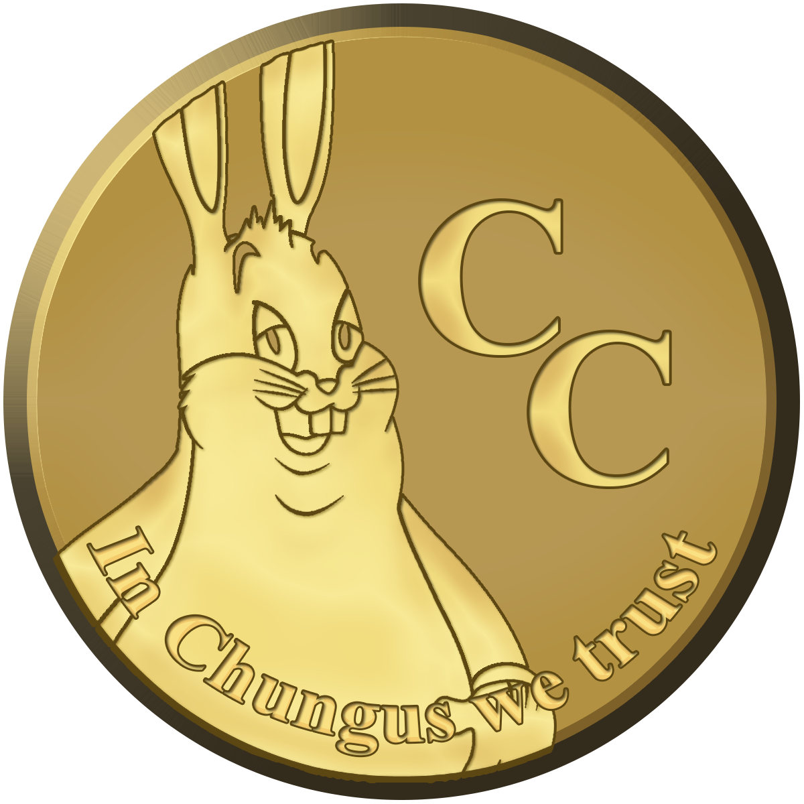

<h1 align="center">
Chunguscoin [CHUNG, Ȼ]  
<br/><br/>

</h1>

<div align="center">

](https://chunguscoin.net)


</div>

Chunguscoin is an meme based, opensource, decentalized, peer-to-peer digital currency with a multipurpose design.

## How to build? ##

#### Linux

```shell
#The following packages are needed:
sudo apt-get install build-essential pkg-config libc6-dev m4 g++-multilib autoconf libtool ncurses-dev unzip git python python-zmq zlib1g-dev wget libcurl4-gnutls-dev bsdmainutils automake curl
```

```shell
git clone https://github.com/ChunguscoinCrypto/Chunguscoin
cd chunguscoin
./zcutil/fetch-params.sh
# -j8 = using 8 threads for the compilation - replace 8 with number of threads you want to use
./build.sh -j8
#This can take some time.
```

#### OSX (Cross-compile using Linux)

Before start, read the following docs: [depends](https://github.com/bitcoin/bitcoin/blob/master/depends/README.md), [macdeploy](https://github.com/bitcoin/bitcoin/blob/master/contrib/macdeploy/README.md) .

Install dependencies:
```
sudo apt-get install curl librsvg2-bin libtiff-tools bsdmainutils cmake imagemagick libcap-dev libz-dev libbz2-dev python3-setuptools libtinfo5 xorriso
```

Place prepared SDK file `Xcode-11.3.1-11C505-extracted-SDK-with-libcxx-headers.tar.gz` in repo root, run `./zcutil/build-mac-cross.sh` in the terminal to build.

#### OSX (Native)
Ensure you have [brew](https://brew.sh) and Command Line Tools installed.
```shell
# Install brew
/usr/bin/ruby -e "$(curl -fsSL https://raw.githubusercontent.com/Homebrew/install/master/install)"
# Install Xcode, opens a pop-up window to install CLT without installing the entire Xcode package
xcode-select --install 
# Update brew and install dependencies
brew update
brew upgrade
brew tap discoteq/discoteq; brew install flock
brew install autoconf autogen automake
# brew install gcc@6
brew install binutils
brew install protobuf
brew install coreutils
brew install wget
# Clone the Chunguscoin repo
git clone https://github.com/ChunguscoinCrypto/Chunguscoin
cd chunguscoin
./zcutil/fetch-params.sh
# -j8 = using 8 threads for the compilation - replace 8 with number of threads you want to use
./zcutil/build-mac.sh -j8
# This can take some time.
```

#### Windows
Use a debian cross-compilation setup with mingw for windows and run:
```shell
sudo apt-get install build-essential pkg-config libc6-dev m4 g++-multilib autoconf libtool ncurses-dev unzip git python python-zmq zlib1g-dev wget libcurl4-gnutls-dev bsdmainutils automake curl cmake mingw-w64
curl https://sh.rustup.rs -sSf | sh
source $HOME/.cargo/env
rustup target add x86_64-pc-windows-gnu

git clone https://github.com/ChunguscoinCrypto/Chunguscoin
cd chunguscoin
./zcutil/fetch-params.sh
# -j8 = using 8 threads for the compilation - replace 8 with number of threads you want to use
./zcutil/build-win.sh -j8
#This can take some time.
```
**chunguscoin is experimental and a work-in-progress.** Use at your own risk.

*p.s.* Currently only `x86_64` arch supported for MacOS, build for `Apple M1` processors unfortunately not yet supported.

## Credits ##

- Forked from KomodoOcean
- Komodo QT Wallet developer: **Ocean**
- Komodo IT Expert / Sysengineer: **Decker**

Repo created by Shafil Alam.